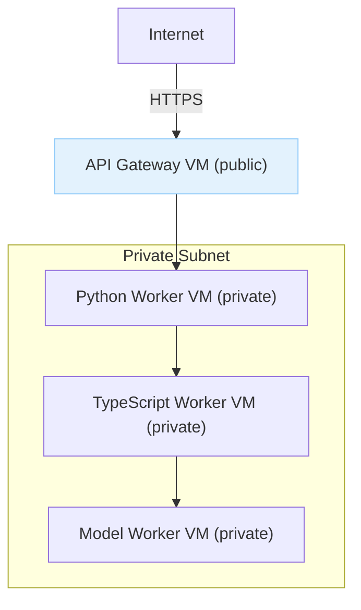

Architecture notes:
- Only the API gateway VM has a public IP and firewall rule allowing HTTP/S and SSH from admin CIDR.
- All worker VMs live in a private subnet (no external IPs). Communication uses private IPs only.
